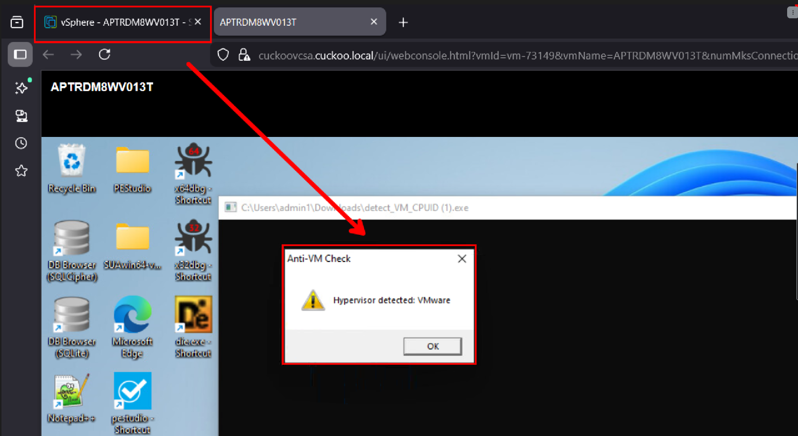

# A2Evasion
A2 Evasion is a security automation tool designed to neutralize sophisticated anti-virtualization (Anti-VM) techniques in real-time. By leveraging Dynamic Binary Instrumentation (DBI), the tool intercepts CPU instructions like CPUID and neutralizes them to mask the analysis environment, forcing malware to execute its true behavior.


This repository contains a proof-of-concept for bypassing anti-analysis logic using (DBI).

### 1. The Target: detect_VM_CPUID.c
A sample C application that mimics malware behavior by querying the CPU for hypervisor signatures (e.g., VMware, VirtualBox) using the 0x40000000 magic leaf. If a VM is detected, the program halts; if not, it executes its payload(in our example it will spawn calc.exe)



Validated on VMware vSphere (ESXi), demonstrating the ability to detect data-center-scale virtualization commonly used in corporate environments.


### 2. Memory patching script: script.js (Frida)

    Scans process memory for the CPUID instruction (0F A2).

    Validates the intent by checking the 64-byte context window for hypervisor-specific setup.

    Neutralizes the check by overwriting the instruction with XOR EAX, EAX in real-time, forcing the application to bypass its own security checks.


# Installation

Before we install this tool make sure you have frida-tools installed on your system
```
git clone https://github.com/rivian96/A2Evasion.git
cd A2Evasion/anti-vm
```

```
frida -l script.js -f detect_VM_CPUID.exe
```
